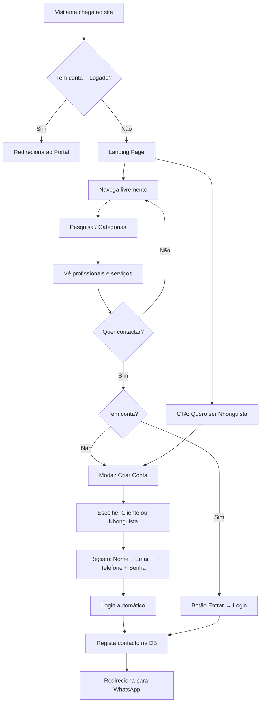
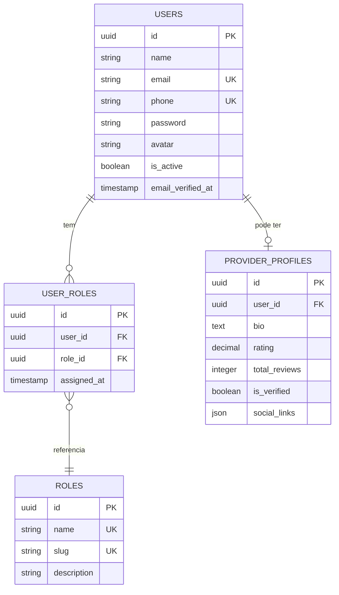
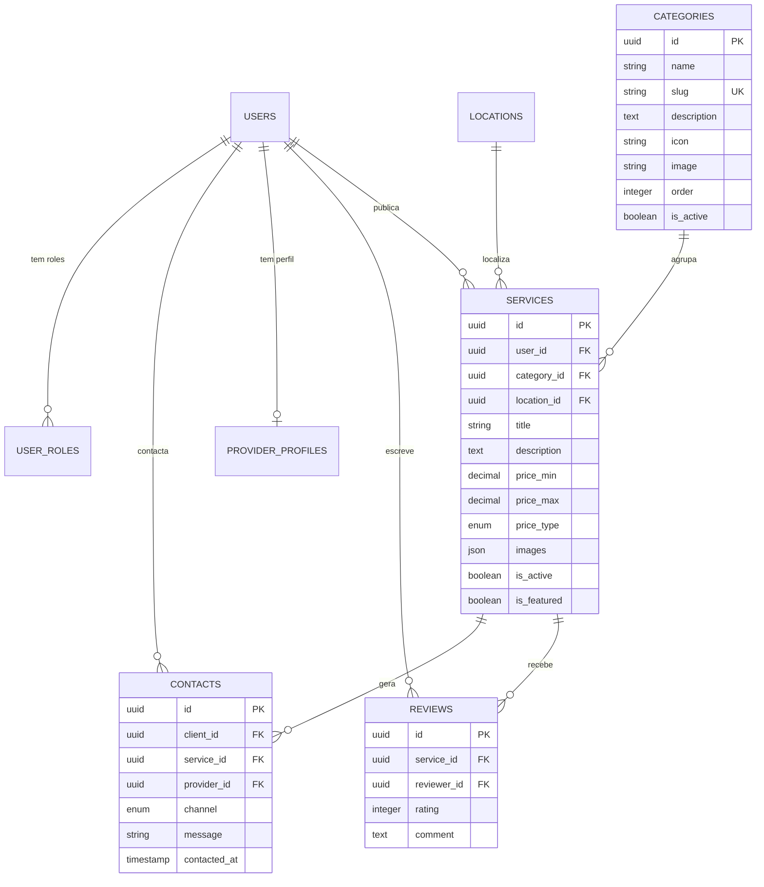
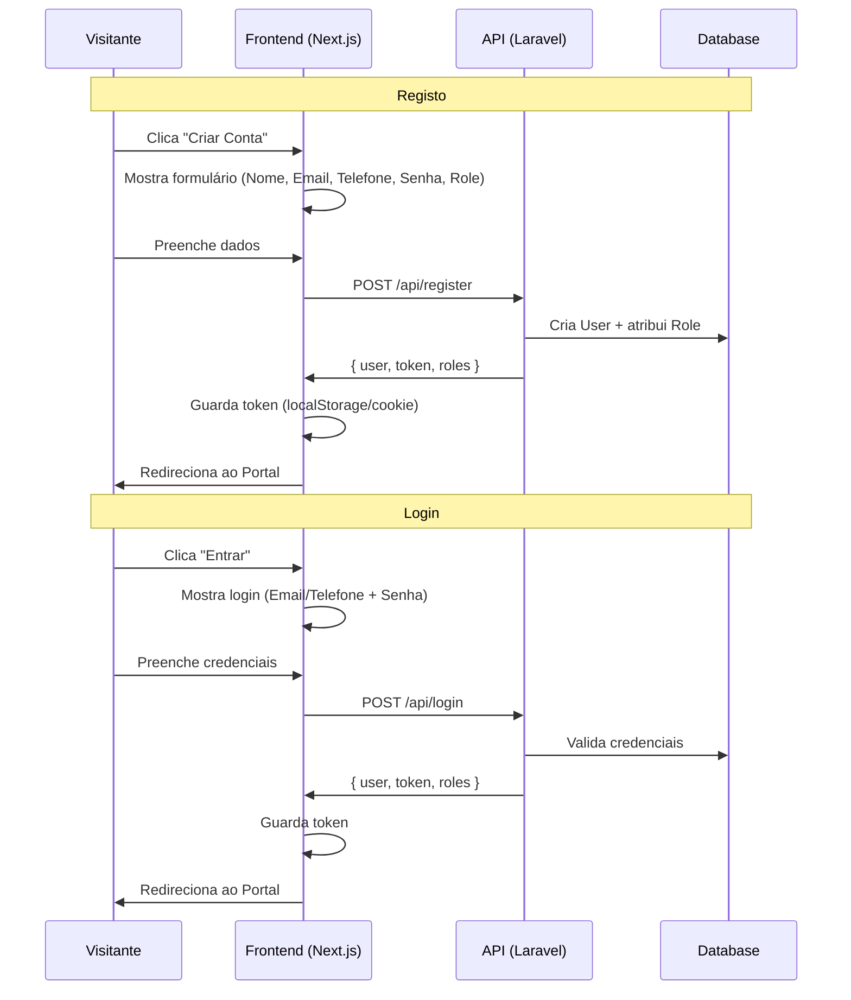
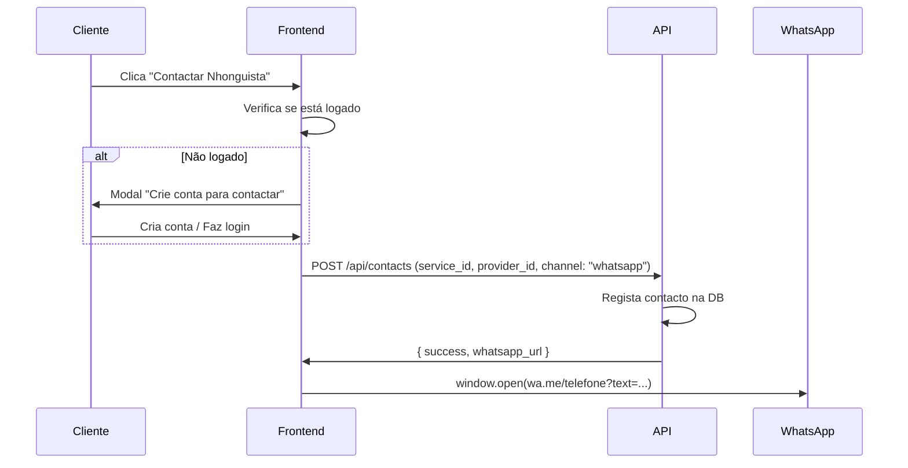

# Fluxo de Utilizador — Nhonguista MVP

> Documento de referência arquitectural para o fluxo de utilizadores na plataforma Nhonguista.

---

## 🗺️ Fluxo Principal



---

## 👥 Sistema de Roles (Multi-Role)

Um utilizador pode ter **múltiplas roles** simultaneamente.



### Roles Disponíveis (seed)
| Role | Slug | Descrição |
|------|------|-----------|
| Cliente | `client` | Pode pesquisar, contactar e avaliar |
| Nhonguista | `provider` | Pode publicar serviços e receber contactos |
| Administrador | `admin` | Gestão total da plataforma |

> **Exemplo:** Um utilizador regista-se como `client`, depois decide oferecer serviços → adiciona-se a role `provider` sem perder a de `client`.

---

## 📊 Modelo de Dados Completo



---

## 🔐 Fluxo de Autenticação



---

## 📱 Fluxo de Contacto (WhatsApp)



---

## 📐 Estrutura de Páginas

```
/ (Landing Page)
├── Navegação livre sem conta
├── Hero + Barra de pesquisa
├── Grid de Categorias (da API)
├── Nhonguistas em destaque (da API)
└── Como funciona + Stats

/categorias/[slug]
├── Lista de serviços da categoria
└── Filtros (preço, localização, avaliação)

/servicos/[id]
├── Detalhe do serviço
├── Perfil do Nhonguista
├── Reviews
└── CTA: Contactar (requer conta)

/nhonguistas
├── Lista de providers
└── Filtros + pesquisa

/nhonguistas/[id]
├── Perfil completo
├── Serviços oferecidos
└── Avaliações recebidas

/entrar → Login
/registar → Registo (com role selection)

/portal (requer auth)
├── Dashboard básico
└── Meus serviços (se provider)
```

---

*Desenvolvido pelos Irmãos Muacigarro & ZEDECK'S IT — Nampula, Moçambique 🇲🇿*
