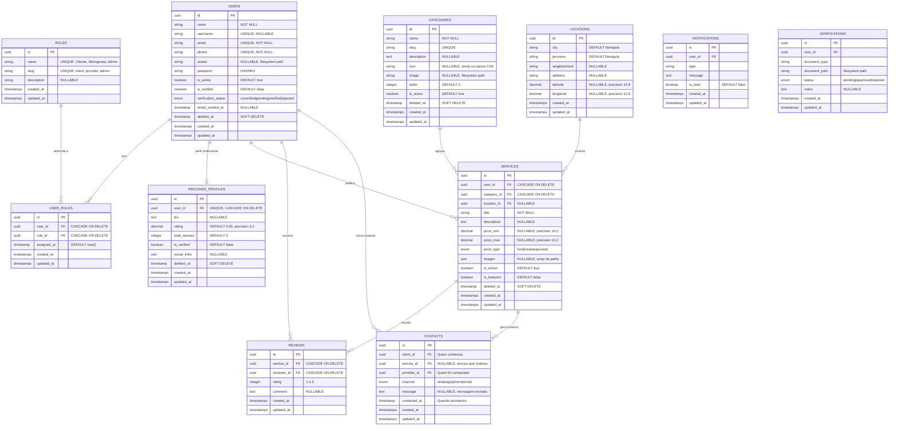

# Modelo de Dados — Nhonguista MVP

> Referência técnica completa do schema de base de dados da plataforma.

---

## 📊 Diagrama Relacional (ERD)

---

## 📏 Índices e Constraints

| Tabela | Índice | Tipo |
|--------|--------|------|
| `users` | `email` | UNIQUE |
| `users` | `phone` | UNIQUE |
| `users` | `username` | UNIQUE |
| `categories` | `slug` | UNIQUE |
| `categories` | `is_active, order` | COMPOSITE |
| `services` | `user_id, category_id` | COMPOSITE |
| `services` | `is_active, is_featured` | COMPOSITE |
| `user_roles` | `user_id, role_id` | UNIQUE (compound) |
| `reviews` | `service_id, reviewer_id` | UNIQUE (um review por serviço) |
| `contacts` | `client_id, provider_id` | INDEX |

---

## 🔑 Decisões Técnicas

1. **UUIDs** em todas as tabelas (segurança + portabilidade)
2. **Soft Deletes** em Users, ProviderProfiles, Categories, Services (auditoria)
3. **Multi-Role** via pivot table (um user pode ser `client` + `provider`)
4. **Imagens**: Filesystem local (`storage/app/public`) via Laravel Storage
5. **Moeda**: Metical (MZN) — preços em `decimal(10,2)`
6. **Contactos**: Sempre registados na DB antes de redirecionar ao WhatsApp

---

## 🌱 Seeds Iniciais

### Roles
- `client` — Cliente
- `provider` — Nhonguista (Profissional)
- `admin` — Administrador

### Categorias
- Limpeza Residencial
- Manutenção Elétrica
- Encanamento
- Pintura
- Desenvolvimento Web
- Design Gráfico
- Fotografia
- Transporte e Mudanças
- Culinária e Confeitaria
- Aulas Particulares

### Localizações
- Nampula Centro, bairros principais

---

*Desenvolvido pelos Irmãos Muacigarro & ZEDECK'S IT — Nampula, Moçambique 🇲🇿*
